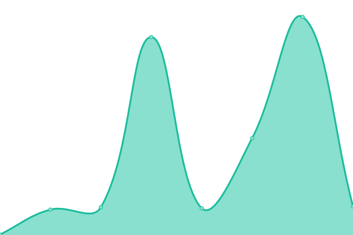
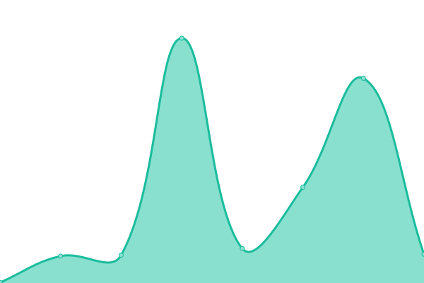

# [📈 Live Status](https://opie4624.github.io/permiso-status): <!--live status--> **🟩 All systems operational**

This repository contains the open-source uptime monitor and status page for [Andrew Kraut](http://opie.at/), powered by [Upptime](https://github.com/upptime/upptime).

With [Upptime](https://upptime.js.org), you can get your own unlimited and free uptime monitor and status page, powered entirely by a GitHub repository. We use [Issues](https://github.com/opie4624/permiso-status/issues) as incident reports, [Actions](https://github.com/opie4624/permiso-status/actions) as uptime monitors, and [Pages](https://opie4624.github.io/permiso-status) for the status page.

<!--start: status pages-->
<!-- This summary is generated by Upptime (https://github.com/upptime/upptime) -->
<!-- Do not edit this manually, your changes will be overwritten -->
<!-- prettier-ignore -->
| URL | Status | History | Response Time | Uptime |
| --- | ------ | ------- | ------------- | ------ |
|  [Homepage](https://permiso.io) | 🟩 Up | [homepage.yml](https://github.com/opie4624/permiso-status/commits/HEAD/history/homepage.yml) | 

 232ms
     
 | 

<a href="https://opie4624.github.io/permiso-status/history/homepage">100.00%</a>
    

|  [Arbiter](https://arbiter.permiso.io) | 🟩 Up | [arbiter.yml](https://github.com/opie4624/permiso-status/commits/HEAD/history/arbiter.yml) | 

 313ms
     
 | 

<a href="https://opie4624.github.io/permiso-status/history/arbiter">100.00%</a>
    

|  [GraphQL](https://arbiter.permiso.io/api/dev/graphql) | 🟩 Up | [graph-ql.yml](https://github.com/opie4624/permiso-status/commits/HEAD/history/graph-ql.yml) | 

 165ms
     
 | 

<a href="https://opie4624.github.io/permiso-status/history/graph-ql">100.00%</a>
    

|  [Arbiter Staging](https://staging-arbiter.permiso.io) | 🟩 Up | [arbiter-staging.yml](https://github.com/opie4624/permiso-status/commits/HEAD/history/arbiter-staging.yml) | 

 305ms
     
 | 

<a href="https://opie4624.github.io/permiso-status/history/arbiter-staging">100.00%</a>
    

|  [GraphQL Staging](https://staging-arbiter.permiso.io/api/dev/graphql) | 🟩 Up | [graph-ql-staging.yml](https://github.com/opie4624/permiso-status/commits/HEAD/history/graph-ql-staging.yml) | 

 222ms
     
 | 

<a href="https://opie4624.github.io/permiso-status/history/graph-ql-staging">100.00%</a>
    

<!--end: status pages-->

[**Visit our status website →**](https://opie4624.github.io/permiso-status)

## 📄 License

- Powered by: [Upptime](https://github.com/upptime/upptime)
- Code: [MIT](./LICENSE) © [Anand Chowdhary](https://anandchowdhary.com), supported by [Pabio](https://pabio.com)
- Data in the `./history` directory: [Open Database License](https://opendatacommons.org/licenses/odbl/1-0/)
